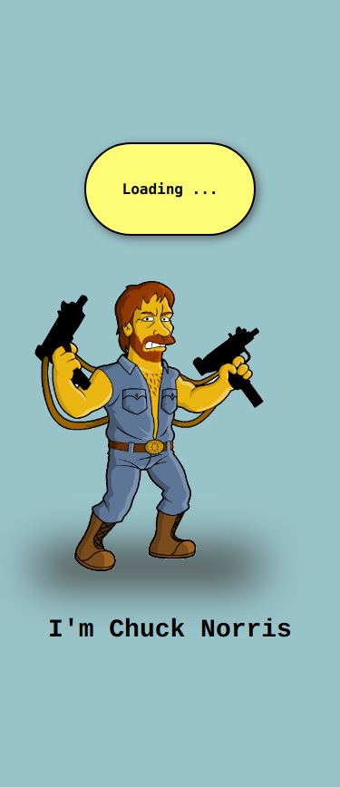
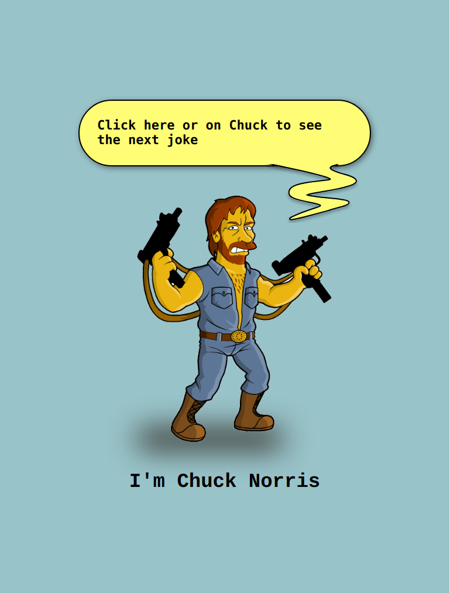

# Chuck Norris Jokes

Practice working with the Fetch API and Promises using pure JavaScript, along with styling done entirely in CSS. This project uses the Chuck Norris API for fun and interactive content.

The static site was deploy with GitHub-Pages.
🔗 [Preview](https://lachicagladiadora.github.io/first-api-chuck-norris/)

## Responsive

### Mobile

### Tablet

### Desktop

## How to run

1. Clone this repository.
2. Install 'Live Server' extension.
   
3. Click on 'Go live' at the bottom left.
   
   And it will open in the browser you have open

## Contributions

If you wish to contribute, please fork and then post a PR with your contribution
